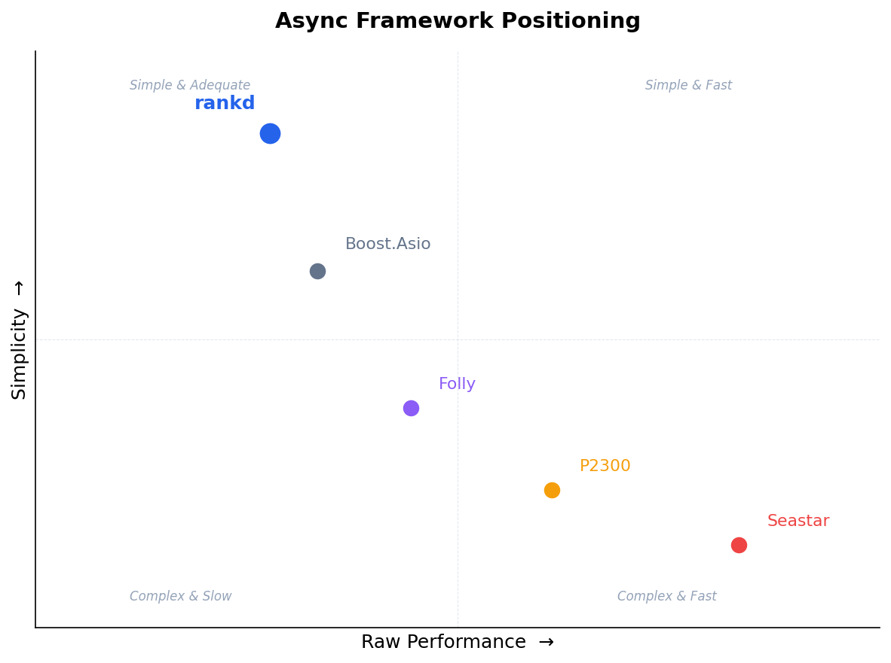

# Async Implementation Comparative Study

**rankd** is a C++23 ranking engine that executes DAG-structured ranking plans against Redis-backed data. It uses a single libuv event loop for I/O coordination, C++20 coroutines (`Task<T>`) for concurrency, and a separate CPU thread pool for compute-heavy work. Plans are authored in TypeScript, compiled to JSON artifacts, and executed by the engine's async DAG scheduler — which tracks node dependencies, enforces deadlines, and manages fan-out/fan-in automatically.

This document compares rankd's async architecture against four major C++ frameworks: **Folly**, **Seastar**, **P2300/io_uring**, and **Boost.Asio**. It covers design trade-offs (§1–2), head-to-head benchmarks on equivalent workloads (§3.2), and recommendations (§6).

---

## 1. Architecture Summary

| Dimension | **rankd** | **Folly** | **Seastar** | **P2300/io_uring** | **Boost.Asio** |
|-----------|-----------|-----------|-------------|--------------------|----|
| **Threading** | 1 event loop + CPU pool | Event loops + thread pools | 1 thread per core (shards) | Scheduler-agnostic | User-run `io_context` (N threads) + optional `thread_pool` |
| **Coroutines** | C++20 `Task<T>` | C++20 coro + fibers + futures | C++20 coro + continuations | C++20 coro + sender/receiver | C++20 coro + stackful + handlers |
| **I/O Backend** | libuv (epoll/kqueue) | libevent (epoll/kqueue) | AIO / io_uring / userspace TCP | io_uring, epoll | epoll, kqueue, IOCP, io_uring |
| **Scheduling** | Lock-free on loop thread | Shared/per-thread queues | Run-to-completion cooperative | Structured concurrency | Strand-based serialization |
| **DAG Support** | Built-in DAG scheduler | Manual (collectAll/Any) | Manual (when_all) | First-class (when_all, then, let_value) | Manual (parallel_group) |
| **Cancellation** | Deadline + timeout awaitables | CancellationToken (cooperative) | abort_source + gate | Stop tokens (propagated) | Cancellation slots/signals |
| **Portability** | Linux + macOS (libuv) | Linux, macOS, Windows | Linux only | Linux (io_uring) | Linux, macOS, Windows, BSD |

---

## 2. Deep Dive: Design Decisions

### 2.1 Event Loop Model

**rankd**: Single libuv thread for all coordination + I/O polling. CPU-heavy work offloaded to a separate thread pool (default 8 threads). All scheduler state mutations happen on the loop thread — no locks needed.

Core implementation in `engine/include/event_loop.h:45`:

```cpp
class EventLoop {
public:
  enum class State : int {
    Idle,      // Not started
    Starting,  // Init in progress (uv_async_init, thread creation)
    Running,   // Loop thread active, accepting Post()
    Stopping,  // Shutdown in progress
    Stopped    // Done, can be destroyed
  };
  // ...
  bool Post(std::function<void()> fn);  // Thread-safe cross-thread callback
```

The `Post()` double-check pattern (`engine/include/event_loop.h:74`) rejects callbacks in non-Running state both before and after acquiring the lock — fail-closed by design.

**Folly**: Similar hybrid. Each `IOThreadPoolExecutor` thread owns an `EventBase` (libevent wrapper). Separate `CPUThreadPoolExecutor` with shared MPMC queue. Multiple event loops possible.

**Seastar**: Radical shared-nothing. One thread per core, each with its own reactor (event loop), memory pool, and task queue. Zero sharing, zero locks. Inter-shard communication via SPSC queues.

**P2300**: No prescribed threading model. Schedulers are pluggable: `io_uring_context` (single-thread), `static_thread_pool`, or custom. The sender/receiver DAG compiles down to a single allocation-free state machine in the best case.

**Boost.Asio**: `io_context` can be run by multiple threads simultaneously. Strands provide serialization. Simple but can hit contention on the shared work queue.

**Assessment**: rankd's single-loop model is simpler than Folly's multi-loop setup and avoids Asio's strand contention. It trades Seastar's linear scaling for simplicity and portability. For a ranking service with moderate core counts (4-16), this is a pragmatic choice.

### 2.2 Coroutine Design

**rankd**: Custom `Task<T>` (`engine/include/coro_task.h`) with `PromiseBase`. Lazy (starts on `.start()` or `co_await`). Key safety invariant: Task must outlive coroutine suspension.

CPU offload pattern (`engine/include/cpu_offload.h:41`):

```cpp
class OffloadCpu {
  // Suspends coroutine on loop thread
  // Submits callable to GetCPUThreadPool()
  // CPU thread executes, captures result in variant
  // Posts resume back to loop thread via loop.Post()
};
```

Timeout race pattern (`engine/include/cpu_offload.h:133`):

```cpp
class OffloadCpuWithTimeout {
  struct State {
    bool completed = false;  // First-wins guard (loop-thread only)
    std::variant<StoredResult, std::exception_ptr> result;
    std::coroutine_handle<> handle;
    uv_timer_t* timer = nullptr;
    EventLoop* loop = nullptr;
  };
  // CPU job and timer race asynchronously.
  // First to set completed=true wins.
  // All mutations on loop thread (no locks).
};
```

Async timeout with detached runner (`engine/include/cpu_offload.h:335`):

```cpp
class AsyncWithTimeout {
  struct State {
    bool done = false;              // First-wins guard (loop-thread only)
    std::optional<Task<void>> runner; // Detached coroutine, kept alive
    // Reference cycle broken by RAII RunnerCleanup
  };
};
```

**Folly**: `folly::coro::Task<T>` by Lewis Baker — the gold standard. Implicit executor binding via `co_viaIfAsync`. Also has `FiberManager` for stackful fibers (useful for bridging callback-based code).

**Seastar**: C++20 coroutines returning `seastar::future<T>`. Continuations are the original API. No fibers. Coroutines run on the shard's reactor thread — no cross-thread resumption.

**P2300**: Senders are more general than coroutines. A sender represents a lazy computation that can be composed without coroutine frames. `co_await` is available but optional.

**Boost.Asio**: `awaitable<T>` for C++20, `yield_context` for stackful. Both integrate with completion handlers.

**Assessment**: rankd's `Task<T>` is functionally similar to Folly's but simpler (no executor binding, since there's only one loop thread). The `OffloadCpu` / `AsyncWithTimeout` pattern is a clean solution to the "resume on correct thread" problem that Folly solves with `co_viaIfAsync`. The main gap: no structured cancellation propagation (must manually check deadlines).

### 2.3 I/O Backend

| | rankd | Folly | Seastar | P2300 | Asio |
|--|-------|-------|---------|-------|------|
| **Linux** | libuv (epoll) | libevent (epoll) | AIO / io_uring | io_uring | epoll / io_uring |
| **macOS** | libuv (kqueue) | libevent (kqueue) | ❌ | ❌ | kqueue |
| **io_uring** | ❌ | ❌ | ✅ | ✅ (native) | ✅ (optional) |
| **Userspace TCP** | ❌ | ❌ | ✅ (DPDK) | ❌ | ❌ |

**Assessment**: rankd uses libuv, which provides cross-platform support but lacks io_uring. For a Redis-backed ranking service where I/O is dominated by Redis RTTs (not raw socket throughput), epoll/kqueue is adequate. io_uring would matter more for disk I/O heavy workloads or millions of IOPS.

### 2.4 DAG Scheduling

This is where rankd has a clear differentiation.

**rankd**: Purpose-built async DAG scheduler (`engine/src/async_dag_scheduler.cpp:108`):

```cpp
struct AsyncSchedulerState {
  // Immutable after init
  const rankd::Plan& plan;
  std::unordered_map<std::string, size_t> node_index;  // node_id -> index
  std::vector<std::vector<size_t>> successors;          // node_idx -> [succ indices]

  // Mutable state (single-threaded, no locks needed)
  std::vector<int> deps_remaining;                      // countdown to 0
  std::vector<std::optional<rankd::RowSet>> results;    // output per node
  size_t inflight_count = 0;                            // running coroutines
  std::queue<size_t> ready_queue;                       // nodes ready to run

  // Coroutine ownership - keeps Task alive until complete
  std::vector<std::optional<Task<void>>> node_tasks;
  std::coroutine_handle<> main_coro;                    // resumed when all done
};
```

Execution flow:
- `init_async_scheduler_state()` (`engine/src/async_dag_scheduler.cpp:142`) — builds in-degree map, finds sources
- `spawn_ready_nodes()` (`engine/src/async_dag_scheduler.cpp:486`) — pops ready queue, spawns coroutines
- `run_node_async()` (`engine/src/async_dag_scheduler.cpp:96`) — per-node: gather inputs → execute → update successors
- `CompletionAwaitable` (`engine/src/async_dag_scheduler.cpp:226`) — main coro suspends until `inflight_count == 0`

**Folly**: No DAG scheduler. `collectAll()` provides fan-out/fan-in but no dependency tracking.

**Seastar**: No DAG scheduler. `when_all()` for fan-out. Cross-shard DAGs require explicit `submit_to()`.

**P2300**: First-class DAG via sender composition (`then`, `when_all`, `let_value`, `transfer`). P2300 shines when graph shape is known in code, enabling aggressive composition and optimization. Dynamic JSON-defined graphs are possible but require an additional runtime type-erasure layer, reducing some of P2300's advantages.

**Boost.Asio**: No DAG primitives. `parallel_group` ([experimental since at least 1.79](https://www.boost.org/doc/libs/1_79_0/doc/html/boost_asio/reference/experimental__make_parallel_group.html)) handles simple fan-out.

**Assessment**: rankd's DAG scheduler is a differentiator. It handles dynamic DAGs (loaded from JSON plan artifacts at runtime) with proper dependency tracking, fan-out/fan-in, and deadline enforcement. Folly/Seastar/Asio would require building this from scratch. P2300's sender model is elegant for statically-composed graphs but would require a runtime type-erasure layer for rankd's dynamic JSON-loaded plans, reducing its zero-allocation advantage.

### 2.5 Timeout & Cancellation

**rankd** (`engine/include/deadline.h`):
- `OffloadCpuWithTimeout` (`cpu_offload.h:133`): "first-wins" race between CPU job and timer
- `AsyncWithTimeout` (`cpu_offload.h:335`): detached runner coroutine + timer race
- Request-level deadline (`--deadline_ms`) and per-node timeout (`--node_timeout_ms`)
- Late completions tracked via `LateCompletionCounter` (discarded but counted)

**Folly**: `CancellationToken` — cooperative. Tasks must poll the token. No automatic propagation through DAG edges.

**Seastar**: `abort_source` — cooperative. `gate` prevents new work during shutdown.

**P2300**: Stop tokens propagated through the entire sender DAG automatically. `set_stopped` is a first-class completion signal alongside `set_value` and `set_error`.

**Boost.Asio**: Per-operation `cancel_after(duration)` (since 1.86). Cancellation slots/signals per operation.

**Assessment**: rankd's timeout model is pragmatic and correct. The main gap vs P2300 is that cancellation doesn't propagate automatically through the DAG — but since rankd checks `deadline_exceeded()` before spawning new nodes, this is effectively equivalent for the fan-out case. The detached-runner pattern for async timeouts is a clever solution that other frameworks don't need (since they typically cancel the operation rather than letting it complete in the background).

### 2.6 Memory Model

**rankd**: Standard heap allocations. Columnar/SoA data model with SelectionVector avoids materializing filtered/sorted results. Dictionary-encoded strings.

**Folly**: General-purpose + `SysArena`, `ThreadCachedArena`. FiberManager pre-allocates stacks.

**Seastar**: Per-core memory pools, NUMA-aware. Custom `malloc()` override. Memory must be freed on the allocating shard.

**P2300**: Senders minimize allocation (stack-allocated state machines). Coroutine frames still heap-allocated.

**Boost.Asio**: Associated allocators per handler. Recycling allocator for repeated operations.

**Assessment**: Seastar is in a different league with per-core NUMA pools. rankd's columnar data model is optimized for the ranking domain (avoiding row materialization), which is more impactful than allocator tuning for this workload.

---

## 3. Benchmark Results

### 3.1 Test Environments

| | **AWS c5.18xlarge** | **macOS (Apple Silicon)** | **x86 Linux (NAS Docker)** | **ARM Linux (Raspberry Pi 4)** |
|--|----------------|--------------------------|---------------------------|-------------------------------|
| CPU | Xeon Platinum 8124M, 72 vCPUs | Apple M-series | Intel x86_64, 4 cores | Cortex-A72, 4 cores |
| RAM | 144 GB | 16+ GB | 7.5 GB | 3.7 GB |
| OS | Ubuntu 22.04 | Darwin 25.2.0 | Debian 12 (bookworm) | Debian 12 (Raspberry Pi OS) |
| Compiler | g++ 13.1 | Apple Clang | g++ 12 | g++ 12 |
| Use | Framework head-to-head | rankd scheduler benchmarks | Cross-platform validation | Cross-platform validation |

### 3.2 Framework Head-to-Head (AWS c5.18xlarge)

All benchmarks compiled with `-O3`, CPU-pinned to cores 0-1 via `taskset`. 2 warm-up + 3 measured runs, median reported. Equivalent workloads across all frameworks.

**Versions**: Boost 1.74 (Asio), libuv 1.44, Folly 2025.05.19 (vcpkg).

**Comparison dimensions**: Tests A and B measure backend-level primitives (queue dispatch, timer heaps). Test C measures abstraction-level behavior (coroutine awaitables vs thread pool offload). We are not claiming equivalence across these levels — see notes per test.

#### Test A: Cross-Thread Post Throughput (1M posts, 1 producer → 1 loop thread)

| Framework | Posts/sec | Wall (ms) | RSS (KB) | Notes |
|-----------|----------|-----------|----------|-------|
| **raw libuv** | **10.0M** | 100 | 1,728 | `uv_async_send` coalesces wakeups; batch drain via `uv_check_t` |
| **Folly** | 3.51M | 285 | 83,520 | `runInEventBaseThread` via lock-free NotificationQueue |
| **rankd** | 2.80M | 358 | 13,248 | libuv `uv_async_send` + mutex queue |
| **Boost.Asio** | 2.09M | 479 | 3,456 | `asio::post()` per-call executor queue dispatch |

libuv dominates because `uv_async_send` [coalesces signals](https://docs.libuv.org/en/v1.x/async.html) — the loop thread drains the entire queue per wakeup rather than per-item. Folly is ~25% faster than rankd due to its lock-free NotificationQueue vs rankd's mutex-protected queue. Asio is slowest due to per-call executor dispatch. Folly's RSS (83MB) reflects its heavier runtime. ²

² RSS measured via `getrusage(RUSAGE_SELF).ru_maxrss` (peak RSS in KB on Linux) at end of measured run. Includes all loaded shared libraries. Values are relative — absolute numbers depend on linking mode (all benchmarks dynamically linked against system libs; Folly via vcpkg shared libs).

#### Test B1: Timer Callback Throughput — Callback Level (10K × 1ms timers)

Raw timer dispatch: schedule 10K timers with 1ms timeout, measure wall time until all fire.

| Framework | Timers/sec | Wall (ms) | p50 (μs) | p99 (μs) |
|-----------|-----------|-----------|----------|----------|
| **raw libuv** | **1.83M** | 5.5 | 2,785 | 3,529 |
| **Boost.Asio** | 1.64M | 6.1 | 3,254 | 3,750 |

Both use purpose-built timer heaps with direct C/completion-handler callbacks. No coroutine overhead.

**Note on Folly's HHWheelTimer** (excluded from this table): Folly's timer component is designed for [managing large numbers of timeouts](https://github.com/facebook/folly/blob/main/folly/io/async/HHWheelTimer.cpp) with O(1) insert/cancel, not for precision sub-10ms timing. Its default tick interval (~10ms) produces 21ms p50 latency in this test — a component positioning difference, not a performance deficiency. Result: 447K timers/sec, 22.4ms wall.

#### Test B2: Timer Throughput — Coroutine Awaitable Level (10K × 1ms timers)

Same workload, but each timer is wrapped in a coroutine awaitable (`SleepMs(1)` for rankd). Includes coroutine frame allocation + suspend/resume overhead on top of the underlying timer backend.

| Framework | Timers/sec | Wall (ms) | p50 (μs) | p99 (μs) | Underlying timer |
|-----------|-----------|-----------|----------|----------|-----------------|
| **rankd** | 1.42M | 7.0 | 4,428 | 5,331 | libuv min-heap via `SleepMs(1)` |

rankd's coroutine overhead adds ~27% wall time vs raw libuv (7.0ms vs 5.5ms). This is the cost of `SleepMs` awaitable: timer init → suspend → timer fires → resume → coroutine cleanup. Folly and Asio coroutine timer benchmarks were not run for this test (their Test C results cover coroutine-level timing).

#### Test C: Fan-Out Concurrent Sleep (1000 × 1ms, 8-thread pool)

Coroutine path: all 1000 sleeps run concurrently on the event loop (wall ≈ sleep duration).
Pool path: 1000 blocking `sleep_for(1ms)` calls submitted to an **8-thread** pool (wall ≈ ceil(1000/8) × 1ms ≈ 125ms).

| Framework | Coro wall (ms) | Coro p50 (μs) | Pool wall (ms) | Pool p50 (μs) | Speedup |
|-----------|---------------|---------------|----------------|---------------|---------|
| **rankd** | **1.7** | 1,465 | 148 | 1,086 | **85.1×** |
| **Folly** | 2.0 | 1,277 | 143 | 1,153 | 72.6× |
| **Boost.Asio** | 2.6 | 1,458 | 143 | 1,153 | 55.1× |

All frameworks use 8-thread pools for the blocking path. Pool wall times are consistent (~143–148ms ≈ ceil(1000/8) × 1ms + scheduling overhead), confirming workload equivalence. rankd's coroutine path is fastest (1.7ms), likely because libuv's timer heap has lower overhead than Folly's `coro::sleep` or Asio's `steady_timer` when scheduling many concurrent timers. Raw libuv excluded (no coroutine support).

#### Summary

```
Test A — Post throughput (higher = better):
  libuv     ████████████████████████████████████████████████  10.0M
  Folly     █████████████████                                  3.5M
  rankd     █████████████                                      2.8M
  Asio      ██████████                                         2.1M

Test B1 — Timer callback throughput (higher = better):
  libuv     ████████████████████████████████████████████████   1.8M
  Asio      ███████████████████████████████████████████        1.6M

Test B2 — Timer coroutine throughput:
  rankd     █████████████████████████████████████              1.4M  (+27% overhead vs raw libuv)

Test C — Coroutine fan-out wall time (lower = better, 8-thread pool):
  rankd     █████████                                          1.7ms  (85×)
  Folly     ██████████                                         2.0ms  (73×)
  Asio      █████████████                                      2.6ms  (55×)
```

**Key insight**: For a Redis-backed ranking service, **network RTT dominates** (typically 50–500μs per Redis call on LAN; varies by deployment). Framework overhead is ~100–500ns per post (in this benchmark) — 2–3 orders of magnitude smaller. The async model's value is enabling high concurrency (100+ in-flight Redis calls) on a single thread, not raw dispatch speed. rankd is competitive with Folly across all three tests with a significantly smaller dependency footprint (~2,800 LOC async runtime vs Folly's full async stack).

### 3.3 rankd Internal Benchmarks

#### 3.3.1 EventLoop Micro-Benchmarks (Cross-Platform)

Run via `engine/bin/rankd --bench_eventloop --bench_json`:

| Metric | macOS (Apple Si) | x86 Linux (NAS) | ARM Linux (Pi 4) |
|--------|-----------------|-----------------|------------------|
| **Post() throughput** | **39.3M ops/sec** | **4.8M ops/sec** | **3.3M ops/sec** |
| **Timer throughput** | **2.8M/sec** | **1.5M/sec** | **608K/sec** |
| **Timer latency p50** | 2,451μs | 4,143μs | 5,548μs |
| **Coro sleep wall** (1K×1ms) | 1.3ms | 0.7ms ³ | 2.9ms |
| **Pool offload wall** (1K×1ms) | 123.6ms | 272.8ms | 283.1ms |
| **Sleep-vs-pool speedup** | **95×** | **390×** | **96×** |

Apple Silicon's Post() throughput (39M/s) is ~8× faster than x86 and ~12× faster than ARM. The sleep-vs-pool speedup demonstrates the core async advantage: 1,000 concurrent 1ms sleeps complete in ~1ms (coroutines) vs ~200ms+ (thread pool, limited by pool size).

³ The 0.7ms result on x86 NAS for a "1ms sleep" is below the requested sleep duration. This is likely due to libuv timer coalescing and the kernel's timer slack on this platform — `SleepMs(1)` uses `uv_timer_start(handle, cb, 1, 0)` which is subject to the event loop's minimum tick resolution. The result should be read as "timer overhead is sub-millisecond" rather than "1ms sleep completes in 0.7ms". Note: `SleepMs(0)` is a no-suspend fast path in rankd and is excluded from these measurements.

#### 3.3.2 Sync vs Async Scheduler (macOS, Plan Execution)

| Scheduler | Throughput (rps) | p50 (μs) | p99 (μs) | Max (μs) |
|-----------|-----------------|----------|----------|----------|
| **Sync** (thread pool) | 1,279 | 748 | 1,317 | 20,052 |
| **Async** (event loop + coro) | 1,554 | 639 | 867 | 4,053 |

Async scheduler: **+21% throughput**, **5× lower max latency** (no thread pool contention spikes).

#### 3.3.3 Concurrency Scaling (macOS, Async Scheduler)

| Concurrency | Throughput (rps) | Scaling | p50 (μs) | p99 (μs) |
|-------------|-----------------|---------|----------|----------|
| 1 | 1,554 | 1.0× | 639 | 867 |
| 2 | 2,899 | 1.9× | 679 | 1,084 |
| 4 | 5,255 | 3.4× | 753 | 1,063 |
| 8 | 9,148 | 5.9× | 859 | 1,105 |
| 16 | 13,897 | 8.9× | 1,131 | 1,827 |

Near-linear scaling up to CPU pool size (8 threads). Beyond 8, pipeline overlap still helps but sub-linear. p99 increases modestly.

#### 3.3.4 Cross-Platform Plan Execution (Sync Scheduler + Redis)

| | macOS (Apple Si) | x86 Linux (NAS) | ARM Linux (Pi 4) |
|--|-----------------|-----------------|------------------|
| **Throughput (rps)** | 1,279 | 6,705 | 822 |
| **p50 (μs)** | 748 | 142 | 1,128 |
| **p99 (μs)** | 1,317 | 253 | 2,416 |

NAS is fastest (Redis in same container, zero network hop). macOS uses TCP loopback. Pi is ~1.5× slower per-request.

> **Note — hiredis 0.14 incompatibility**: The async scheduler crashes on Debian 12 (hiredis 0.14.1). Sync scheduler works. Requires hiredis ≥1.0 for stable async support. Action: pin hiredis ≥1.0.0 in CMakeLists.txt.

---

## 4. Strengths & Gaps

### What rankd Does Well

| Strength | Detail | Code Reference |
|----------|--------|----------------|
| **Purpose-built DAG scheduler** | In-degree counting, fan-out/fan-in, deadline enforcement | `engine/src/async_dag_scheduler.cpp:108` |
| **Single-loop simplicity** | No locks on scheduler state. No strand confusion. | `engine/include/event_loop.h:45` |
| **Correct timeout model** | "First-wins" race with safe late-completion handling | `engine/include/cpu_offload.h:133,335` |
| **Domain-optimized data model** | Columnar/SoA + SelectionVector + dictionary strings | Engine data structures |
| **Portable** | libuv gives Linux + macOS. No kernel version requirements | CMake libuv dep |
| **Safe shutdown** | Atomic state machine with drain contract | `engine/include/event_loop.h:48` |

### Gaps to Consider

| Gap | Frameworks That Do Better | Impact | Effort |
|-----|--------------------------|--------|--------|
| **No io_uring** | Seastar, P2300, Asio | Low for Redis workloads (RTT-dominated) | Medium |
| **No auto cancellation propagation** | P2300 (stop tokens) | Low (deadline check before spawn is equivalent) | High |
| **No work-stealing** | Some P2300 pools | Low (CPU pool is shared-queue, adequate for 8-16 threads) | Medium |
| **No per-core memory pools** | Seastar | Low-medium (depends on allocation pressure) | High |
| **No fiber support** | Folly (FiberManager) | Low (coroutines sufficient) | Medium |
| **Single event loop** | Folly (multi-EventBase), Seastar (per-core) | Low at current scale. Bottleneck above ~50K concurrent I/O | Medium |

---

## 5. Architectural Positioning



rankd sits in the **"right-sized for the domain"** sweet spot:
- More capable than Asio for DAG workloads (built-in scheduler)
- Simpler than Folly (single loop, no executor algebra) — ~2,800 LOC async runtime ¹
- More portable than Seastar (macOS support, no DPDK dependency)
- More practical than P2300 (dynamic plans, production-ready today)
- ~80% of Folly's post throughput, fastest coroutine fan-out of all three frameworks

¹ LOC counted across `event_loop`, `coro_task`, `cpu_offload`, `uv_sleep`, `async_dag_scheduler`, `deadline`, `async_redis_client` (headers + sources, excluding benchmarks). This is the async runtime only — not the full engine.

---

## 6. Performance Roadmap

### 6.1 Bottleneck Model

For a ranking orchestration service on a 64-core machine with multiple I/O backends (Redis, Postgres, TAO-like social graph, feature stores like DuckDB, ML model serving), request latency decomposes roughly as:

```
Request latency ≈ Redis RTT × sequential_depth + CPU_compute + scheduling_overhead

Typical breakdown:
  60-70%  I/O wait (Redis, PG, feature store, model serving)
  20-30%  CPU (expression eval, filtering, sorting)
   1-5%   Framework overhead (scheduling, allocation, serialization)
```

Optimization priority follows this breakdown: **reduce I/O wait → parallelize CPU → reduce allocations**.

### 6.2 Current Bottlenecks

| Bottleneck | Where | Impact at 64 cores |
|------------|-------|---------------------|
| **Serial Redis commands** | `AsyncRedisClient` issues one command per callback, no pipelining | Fan-out of 100 = 100 × RTT (~10ms). Dominates request latency. |
| **Single event loop** | All DAG scheduling, Redis completions, CPU task posting on one thread | 63 cores idle during scheduling. Caps throughput ~10-20K rps. |
| **Single Redis connection per endpoint** | Inflight limiter caps at 64 concurrent commands per endpoint | Can't saturate a Redis instance from one connection. |
| **Mutex-protected CPU pool queue** | `std::queue + mutex + cv` in `ThreadPool` | Contention rises with core count. |
| **Deep copies on CPU offload** | `async_dag_scheduler.cpp:356` copies all inputs, params, expr tables before pool submit | Large fan-out results (100+ rows × many columns) copied per CPU task. |

### 6.3 Phase 1: I/O Path (highest impact)

#### Redis Pipelining

Biggest single win. Currently a `follow` task with fanout=100 issues 100 serial `LRANGE` commands, each paying a full RTT (typically 50–500μs on LAN, so 100 commands ≈ 5–50ms total). With pipelining, all 100 commands are written in one batch; replies arrive in one read.

```
Before:  cmd₁ → wait → reply₁ → cmd₂ → wait → reply₂ → ...  (N × RTT)
After:   cmd₁,cmd₂,...,cmdₙ → wait → reply₁,reply₂,...,replyₙ  (1 × RTT)
```

**Expected gain**: 50-100× on fan-out I/O latency. The inflight limiter already exists; pipelining slots in underneath as a batched write/read layer in `AsyncRedisClient`.

#### Multiple Event Loops (Sharded)

The proven pattern from Folly (`IOThreadPoolExecutor`), envoy, and nginx:

```
                    ┌─ EventLoop[0] ─── Redis conns ─── CPU pool[0]
Incoming requests ──┼─ EventLoop[1] ─── Redis conns ─── CPU pool[1]
   (round-robin)    ├─ EventLoop[2] ─── Redis conns ─── CPU pool[2]
                    └─ EventLoop[N] ─── Redis conns ─── CPU pool[N]
```

Each loop owns its Redis connections, CPU threads, and DAG scheduler state. Zero cross-loop synchronization — `AsyncSchedulerState` is already single-threaded by design. N = cores / 8 (e.g., 8 loops on 64 cores, each with 8 CPU threads).

**Expected gain**: Linear throughput scaling with N loops. 8 loops → ~8× throughput.

#### Connection Pooling

One connection per endpoint per loop. With 8 loops × 4 connections/endpoint × 64 inflight = 2,048 concurrent Redis commands. Combined with pipelining, this saturates a Redis instance.

### 6.4 Phase 2: CPU Path

#### Lock-Free Work-Stealing CPU Pool

Replace `std::queue + mutex + cv` with a work-stealing deque (Chase-Lev or similar). Each worker thread has a local deque; steals from others when empty. Eliminates single-queue contention. Matters when many short CPU tasks run concurrently (vm eval on small batches).

#### Per-Request Arena Allocator

Not jemalloc/tcmalloc (those help ~5-10% from better thread-local caching). What actually moves the needle is a per-request bump allocator:

```cpp
RequestArena arena(64 * 1024);  // 64KB initial
auto* id_col = arena.alloc<IdColumn>(n_rows);
auto* float_col = arena.alloc<FloatColumn>(n_rows);
// All request data contiguous in memory → cache-friendly
// Arena freed in one shot when request completes
```

Eliminates hundreds of individual `malloc/free` per request. Improves cache locality (all request data contiguous). Also simplifies the CPU offload copy problem — if the arena lives for the request's lifetime, CPU tasks can reference arena data instead of deep-copying.

#### Batched Fan-Out Tasks

Application-level batching on top of pipelining. Instead of `follow` issuing N individual `LRANGE` commands, use Redis `MGET` or a Lua script that returns all followee lists in one call. Reduces command count from N to 1. Requires task-level changes; DAG scheduler unchanged.

### 6.5 Phase 3: Compute Path

#### SIMD VM and Filter Evaluation

The VM evaluator loops over rows evaluating expressions. With AVX-512 on Xeon (available on c5 instances):
- Float column arithmetic: 8 doubles per instruction
- Validity bitmap operations: 64 bits at a time
- String `in` predicate: SIMD string comparison

**Expected gain**: 2-4× on CPU-bound tasks. Net ~10-15% overall (CPU is 20-30% of request time).

#### Shared String Dictionaries

Currently each task creates a new `StringDictColumn` dictionary. If `follow` produces 100 rows with country strings, and `filter` passes 50 through, the filter allocates a new dictionary with the same strings. Sharing dictionaries within a request (or using a global intern table) saves allocation and enables pointer comparison.

### 6.6 Not Prioritized

| Approach | Why not |
|----------|---------|
| **io_uring** | Saves ~1-5μs per syscall. Redis RTT (~100μs) dominates. ROI too low vs pipelining. Revisit when I/O path is saturated. |
| **P2300 / sender-receiver** | Zero-alloc senders require compile-time graphs; rankd loads dynamic DAGs from JSON. Main benefit is engineering hygiene (stop tokens, structured concurrency), not performance. Revisit when C++26 stabilizes. |
| **Seastar adoption** | Requires full shared-nothing data partitioning. Too invasive for the expected gain. |
| **Folly migration** | ~500K lines of dependency for marginal benefit over the current stack. |
| **jemalloc/tcmalloc** | ~5-10% general allocation speedup. Dwarfed by I/O wins. Do after arena allocator. |

### 6.7 Expected Impact Summary

| Phase | Change | Estimated gain | Complexity |
|-------|--------|---------------|------------|
| 1 | Redis pipelining | **50-100× fan-out I/O latency** | Medium |
| 1 | Multiple event loops (×8) | **~8× throughput** | Medium-high |
| 1 | Connection pooling | **2-4× Redis concurrency** | Low |
| 2 | Work-stealing CPU pool | **2-3× CPU task dispatch** | Medium |
| 2 | Per-request arena | **~30% fewer mallocs, better locality** | Medium |
| 2 | Batched fan-out | **N× fewer Redis commands** | Low-medium |
| 3 | SIMD eval | **2-4× CPU-bound tasks** | Medium |
| 3 | Shared string dicts | **~10-20% string column ops** | Low |

---

## 7. Key Takeaway

> The async implementation is architecturally sound and well-positioned. Its main advantage — a purpose-built DAG scheduler with deadline enforcement — is something none of the general frameworks provide out of the box. The trade-offs (single event loop, libuv, no pipelining) are appropriate for current scale but have clear upgrade paths for 64-core production deployments. The highest-ROI changes are I/O-layer improvements (Redis pipelining, sharded event loops) — not framework migration or allocator tuning.

---

## Changelog

| Rev | Date | Changes |
|-----|------|---------|
| v5 | 2026-02-01 | **Review hardening**: Fixed ns/post range (25–200 → 100–500) to match Test A data. Fixed Asio threading description ("implicit pool" → user-run `io_context`). Split Test B into B1 (callback-level) and B2 (coroutine-level) to eliminate cross-layer comparison. Added RSS measurement methodology footnote. Explained 0.7ms anomaly in §3.3.1 (libuv timer coalescing + kernel slack). Softened P2300 dynamic graph claim. Softened Redis RTT range to "varies by deployment". |
| v4 | 2026-02-01 | **Performance roadmap**: Replaced generic §6 Recommendations with detailed §6 Performance Roadmap. Three-phase plan grounded in bottleneck analysis (I/O path → CPU path → compute path). Added §6.1 bottleneck model, §6.2 current bottlenecks, §6.3–6.5 phased improvements with expected gains, §6.6 deprioritized approaches, §6.7 impact summary. Updated §7 Key Takeaway. |
| v3 | 2026-02-01 | **Benchmark re-run (v2)**: Fixed Test C pool thread count — rankd now uses 8-thread pool (was `hardware_concurrency()` = 72, producing misleading 17ms pool wall). All frameworks now use matched 8-thread pools; pool baselines within 3% of each other (143–148ms). Added comparison dimension statement to §3.2. Clarified abstraction levels in Test B (added column + notes). Reframed Folly HHWheelTimer as component positioning, not perf deficiency. Fixed Asio `parallel_group` version (≥1.79, not 1.80). Replaced "~600× less code" with auditable "~2,800 LOC" with methodology footnote. |
| v2 | 2026-02-01 | **Head-to-head benchmarks**: Added §3.2 with Folly/Asio/libuv results from AWS c5.18xlarge. Added positioning chart (matplotlib PNG). Reorganized §3: head-to-head first, rankd-internal grouped as §3.3. Demoted hiredis bug to inline note. |
| v1 | 2026-02-01 | Initial draft. Architecture comparison (§1–2), rankd-only benchmarks across macOS/x86/ARM (§3), strengths & gaps (§4), recommendations (§6). |
